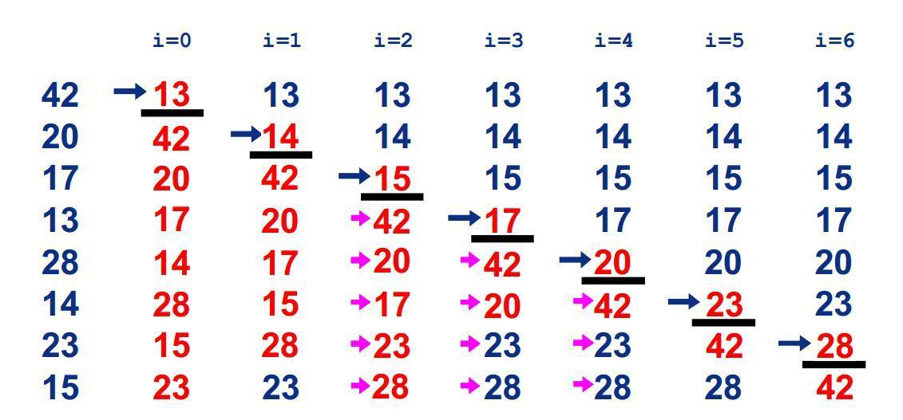

# 冒泡排序-BubbleSort
## 基本思想
通过对相邻两个数据的比较及其交换来达到排序的目的.
## 排序过程
- 首先，将 n 个元素中的第一个和第二个进行比较，如果两个元素的位置为逆序，则交换两个元素的位置；
- 进而比较第二个和第三个元素关键字，如此类推，直到比较第 n-1 个元素和第 n 个元素为止； 
- 上述过程描述了起泡排序的第一趟排序过程，在第一趟排序过程中，我们将关键字最大的元素通过交换操作放到了具有 n 个元素的序列的最一个位置上。 
- 然后进行第二趟排序，在第二趟排序过程中对元素序列的前 n-1 个元素进行相同操作，其结果是将关键字次大的元素通过交换放到第 n-1 个位置上。一般来说，第 i 趟排序是对元素序列的前 n-i+1 个元素进行排序，使得前 n-i+1 个元素中关键字最大的元素被放置到第 n-i+1 个位置上。排序共进行 n-1 趟，即可使得元素序列按关键字有序。

总结冒泡排序的思路：
1. 每一次的外部排序，确定一个数的顺序
2. 外部排序的次数是 数组的大小-1
3. 每次外部排序的比较次数在减少.
4. 每外部排序的比较次数-1
## 平均时间复杂度
- O(n^2)
## 算法优化
### 问题：
数据的顺序排好之后，冒泡算法仍然会继续进行下一轮的比较，直到arr.length-1次，后面的比较没有意义的。

### 优化方案：
设置标志位flag，如果发生了交换flag设置为true；如果没有交换就设置为false。

这样当一轮比较结束后如果flag仍为false，即：这一轮没有发生交换，说明数据的顺序已经排好，没有必要继续进行下去。
## 代码实现
* GO
* Java