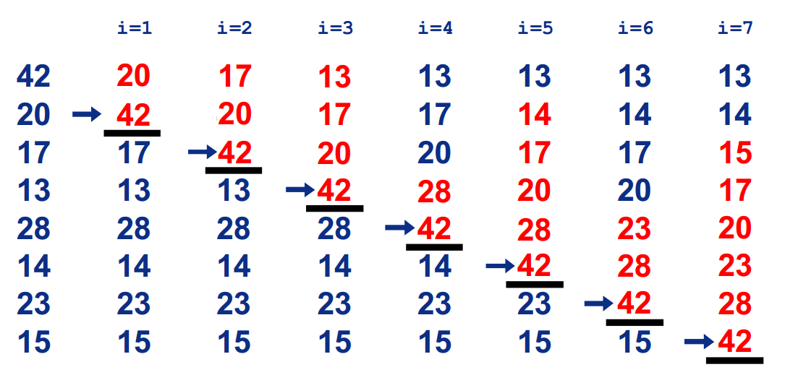

# 插入排序-InsertionSort
## 基本思想
- 把n个待排序的元素看成为一个有序表和一个无序表，
- 开始时有序表中只包含一个元素，无序表中包含有n-1个元素，
- 排序过程中每次从无序表中取出第一个元素，把它的排序码依次与有序表元素的排序码进行比较，将它插入到有序表中的适当位置，使之成为新的有序表。

总结：
- 在要排序的一组数中，假定前n-1个数已经排好序，现在将第n个数插到前面的有序数列中，使得这n个数也是排好顺序的。如此反复循环，直到全部排好顺序。
## 排序过程

## 平均时间复杂度
- O(n^2)
## 代码实现
* GO
* Java