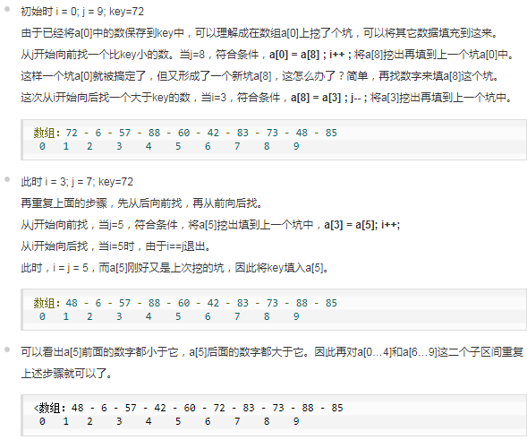

# 快速排序-QuickSort
## 基本思想 - 分治
1. 从数列中挑出一个元素，称为 "基准"（pivot）;

2. 重新排序数列，所有元素比基准值小的摆放在基准前面，所有元素比基准值大的摆在基准的后面（相同的数可以到任一边）。在这个分区退出之后，该基准就处于数列的中间位置。这个称为分区（partition）操作；

3. 递归地（recursive）把小于基准值元素的子数列和大于基准值元素的子数列排序；
## 排序过程

## 平均时间复杂度
- O(N*logN)
## 代码实现
* GO
* Java